# Chukwuma Zikora

## Senior Software Engineer | Full-Stack & Platform Infrastructure

[](https://www.linkedin.com/in/chukwumazikora)
[](https://chukwumaijem.github.io/)
[](mailto:chukwuma.zikora@gmail.com)

---

## What I Do

I build software — and the systems that keep it running. Senior software engineer based in Nigeria with 10+ years shipping full-stack SaaS products and owning the CI/CD, cloud, and containerised infrastructure that keeps them reliable in production.

---

## Core Expertise

### Platform & Infrastructure

- **Containers & Orchestration:** Docker, Kubernetes, Helm
- **CI/CD & Automation:** GitHub Actions, GitLab CI/CD, CircleCI, Ansible
- **Cloud:** AWS (Lambda, API Gateway, serverless), multi-environment deployments

### Full-Stack Development

- **Frontend:** TypeScript, React, Next.js, Vue.js, Redux / Pinia
- **Backend:** Node.js, NestJS, Express, REST, GraphQL (Hasura & Apollo), microservices
- **Databases & ORMs:** PostgreSQL, MongoDB, TursoDB, Redis · Prisma, DrizzleORM, Sequelize
- **Testing:** Jest, Playwright, Vitest

---

## Featured Work

### Open Source — [blockqueue](https://github.com/blockqueue)

**[Mailer](https://github.com/blockqueue/mailer)** · TypeScript · Apache-2.0  
Self-hostable email orchestration microservice: pluggable templates (React Email, MJML, HTML), dual auth (API keys & HMAC), rate limiting, and Docker-first config.

**[BQ Queue](https://github.com/blockqueue/bq-queue)** · TypeScript · Apache-2.0  
Self-hostable job queue and signed webhook delivery on PostgreSQL / pg-boss — shared scheduling, idempotency, and Docker Compose for multi-service backends.

---

## Tech Stack

```typescript
const techStack = {
  languages: ["TypeScript", "JavaScript", "Go", "Python"],
  frontend: ["React", "Next.js", "Vue.js", "Tailwind CSS"],
  backend: ["Node.js", "Express", "NestJS", "GraphQL"],
  databases: ["PostgreSQL", "MongoDB", "TursoDB", "Redis"],
  orms: ["Prisma", "DrizzleORM", "Sequelize"],
  platform: ["Docker", "Kubernetes", "Helm", "AWS"],
  cicd: ["GitHub Actions", "GitLab CI", "CircleCI", "Ansible"],
  tools: ["Turbo", "SST", "Playwright", "Jest"],
};
```

---

## GitHub Analytics




---

## Focus Right Now

- **Platform engineering:** Reliable CI/CD, container orchestration, and cloud architecture for production SaaS
- **Product building:** Shipping and operating BlockQueue products for the African market
- **Kubernetes:** Deepening practice toward CKAD
- **Open source:** Self-hostable infrastructure tooling under [blockqueue](https://github.com/blockqueue)

---

## Get In Touch

- **Email:** [chukwuma.zikora@gmail.com](mailto:chukwuma.zikora@gmail.com)
- **LinkedIn:** [linkedin.com/in/chukwumazikora](https://www.linkedin.com/in/chukwumazikora)
- **Portfolio:** [chukwumaijem.github.io](https://chukwumaijem.github.io/)

---

> _"Success is not final, failure is not fatal: it is the courage to continue that counts.."_
